  

<h1>୨୧ PRADNYA WAKODE ୨୧</h1>

  <b>Cloud</b> · <b>Software</b> · <b>AI</b>

  <i>building things, learning things, and occasionally wondering why they broke.</i>

 

<a href="https://github.com/Pradnya1227">GITHUB</a>
  ✦   <a href="https://leetcode.com/u/pradnyawakode27/">LEETCODE</a>
  ✦   <a href="mailto:pradnyawakode2712@gmail.com">EMAIL</a>
  ✦   <a href="https://drive.google.com/drive/folders/1VBYioCvL71WyRS4d-ldadxa7i_BdP_nq?usp=drive_link">RESUME</a>

  

✦ ───────────────────────────────────────── ✦

 

## ୨୧ ABOUT ME

  I'm a final-year Computer Engineering student interested in
  <b>cloud infrastructure, software engineering, distributed systems and AI.</b>

  I enjoy building full-stack applications and cloud-integrated systems,
  while going deeper into <b>DevOps</b> and <b>system design</b>.

 

<code>curious mind</code>
  <code>practical builder</code>
  <code>perpetual debugger</code>

  

✦ ───────────────────────────────────────── ✦

 

## ୨୧ TECH UNIVERSE

  <b>LANGUAGES</b>

  

  <b>DEVELOPMENT</b>

  

  <b>CLOUD & INFRASTRUCTURE</b>

  

  <b>DATA & TOOLS</b>

  

 

## ୨୧ SELECTED WORK

  <i>a few things I've been building</i>

 

<table align="center" width="92%">
<tr>
<td align="center" width="50%">

 

<h3>✦ DISTRIBOOK</h3>

<b>Distributed Classroom & Laboratory Booking</b>

A service-separated booking platform designed around
distributed-system concepts.

<code>React</code> <code>Node.js</code> <code>PostgreSQL</code>

<a href="https://github.com/Pradnya1227">
<b>EXPLORE ↗</b>
</a>

</td>

<td align="center" width="50%">

 

<h3>✦ LEGACYVAULT</h3>

<b>Digital Legacy Management System</b>

A full-stack system exploring digital inheritance
and intelligent document processing.

<code>React</code> <code>TypeScript</code> <code>Node.js</code>

<a href="https://github.com/Pradnya1227/legacyvault-frontend">
<b>EXPLORE ↗</b>
</a>

</td>
</tr>

<tr>
<td align="center" width="50%">

 

<h3>✦ FUELGUARD</h3>

<b>Fleet Fuel Monitoring System</b>

An IoT monitoring pipeline connecting embedded devices
with cloud infrastructure and analytical processing.

<code>ESP32</code> <code>Supabase</code> <code>Python</code>

<a href="https://github.com/Pradnya1227/FuelGuard-Fuel-theft-detection">
<b>EXPLORE ↗</b>
</a>

</td>

<td align="center" width="50%">

 

<h3>✦ TASK MANAGER</h3>

<b>Flutter Mobile Application</b>

A clean mobile task-management application with
Firebase backend integration.

<code>Flutter</code> <code>Dart</code> <code>Firebase</code>

<a href="https://github.com/Pradnya1227">
<b>EXPLORE ↗</b>
</a>

</td>
</tr>
</table>

 

<a href="https://github.com/Pradnya1227?tab=repositories">
  <b>VIEW ALL PROJECTS →</b>
</a>

 

✦ ───────────────────────────────────────── ✦

 

## ୨୧ GITHUB UNIVERSE

  <i>my little coding constellation</i>

 

<!-- GitHub Stats -->

<!-- GitHub Streak -->

  

<!-- Activity -->

  

✦ ───────────────────────────────────────── ✦

 

## ୨୧ CODING SIGNAL

  <i>languages showing up across my repositories</i>

 

  

 

✦ ───────────────────────────────────────── ✦

 

## ୨୧ CURRENTLY

<table align="center" width="85%">
<tr>

<td align="center" width="33%">

### ☁️

<b>LEARNING</b>

  

Cloud Infrastructure 
Distributed Systems 
DevOps 
System Design

</td>

<td align="center" width="33%">

### 💻

<b>BUILDING</b>

  

Cloud-integrated software 
Full-stack applications 
Distributed systems

</td>

<td align="center" width="33%">

### ✦

<b>EXPLORING</b>

  

Scalable architecture 
Cloud technologies 
AI applications

</td>

</tr>
</table>

 

✦ ───────────────────────────────────────── ✦

 

## ୨୧ PROFILE VISITORS

 

  

## ୨୧ CURRENTLY

<table align="center" width="85%">
<tr>

<td align="center" width="33%">

### ☁️

<b>LEARNING</b>

  

Cloud Infrastructure
Distributed Systems
DevOps
System Design

</td>

<td align="center" width="33%">

### 💻

<b>BUILDING</b>

  

Cloud-integrated software
Full-stack applications
Distributed systems

</td>

<td align="center" width="33%">

### ✦

<b>EXPLORING</b>

  

Scalable architecture
Cloud technologies
AI applications

</td>

</tr>
</table>

 

 

## ୨୧ PROFILE VISITORS

 

  

  

&nbsp;

&nbsp;

  

୨୧ built with curiosity · caffeine · and questionable debugging decisions ୨୧

  

